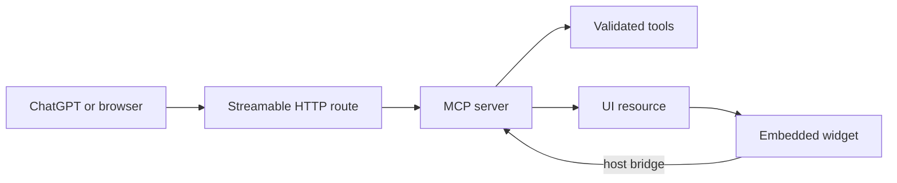

# MCP Studio

MCP Studio is an open source starter and visual workbench for building ChatGPT apps with the Model Context Protocol and the MCP Apps extension.

It combines a browser playground, a production Streamable HTTP endpoint, validated tools, embeddable `ui://` resources, a theme aware ChatGPT widget, and five attributed admin dashboard templates in one deployable project.

Live demo: https://web-based-chatgpt-mcp-starter.ruv.chatgpt.site

MCP endpoint: `https://web-based-chatgpt-mcp-starter.ruv.chatgpt.site/api/mcp`

## What ships

| Capability | Included |
| --- | --- |
| Streamable HTTP MCP | Stateless JSON RPC endpoint with CORS and bounded request bodies |
| ChatGPT embedded UI | Self contained `text/html;profile=mcp-app` resource |
| Browser playground | Run tools, inspect structured responses, and read resources |
| Template builder | Five responsive admin surfaces with light and dark modes |
| Tool validation | Strict Zod schemas and deterministic read only handlers |
| Host bridge | Tool calls, tool results, host theme, auto resize, and follow up messages |
| RuFlo | Full project initialization for coordinated Claude and Codex work |
| Sites deployment | Cloudflare Workers compatible Vinext build |

## Template catalog

The templates are functional interpretations of dashboard interaction patterns. They do not copy proprietary logos or source assets. Each template links directly to its design reference and creator.

1. Signal Analytics, inspired by [HALO LAB](https://dribbble.com/shots/21590789-Logip-Admin-Dashboard-Analytics-UX)
2. Order Command, inspired by [Shakuro](https://dribbble.com/shots/24445564-E-Commerce-Admin-Dashboard-Design-Concept)
3. Fleet Pulse, inspired by [Ronas IT](https://dribbble.com/shots/27539359-Logistics-Admin-Dashboard-Fleet-Management)
4. Care Calendar, inspired by [Phenomenon Studio](https://dribbble.com/shots/27005103-Appointments-Admin-Dashboard-UI-Clinexa)
5. Ledger Flow, inspired by [Halal Lab](https://dribbble.com/shots/23929065-Fintech-Admin-Dashboard-B2B-SaaS-UI-UX-Design)

## Architecture



The website and embedded widget call the same server. Browser mode uses the public HTTP transport. ChatGPT mode uses the Apps SDK host bridge. Tool results carry both model readable text and structured content.

## MCP tools

| Tool | Purpose | Opens UI |
| --- | --- | --- |
| `show_dashboard` | Render the starter calculator and examples | Yes |
| `get_examples` | Return reusable MCP patterns | No |
| `calculate_estimate` | Calculate cost and sequential duration | No |
| `list_embed_templates` | Return the attributed template catalog | No |
| `open_template_builder` | Render the template selector inside ChatGPT | Yes |

All tools are read only, deterministic, and require no API key. The calculator uses user supplied assumptions, not provider pricing.

## Routes

| Route | Behavior |
| --- | --- |
| `/` | Playground, template builder, tool schemas, resource inspector, and setup guide |
| `/api/mcp` | Canonical stateless Streamable HTTP MCP endpoint |
| `/api/mp` | Compatibility alias for clients that saved the earlier short path |
| `/widget?mode=web` | Browser version of the embedded widget |
| `/resource` | Resource metadata and a `resources/read` request example |
| `ui://starter/dashboard.html` | Bundled MCP Apps HTML resource |

The legacy `/mcp` application route is retained in source but some managed hosting edges reserve that path. Use `/api/mcp` for remote clients.

## Quick start

Requirements: Node.js 22.13 or later and pnpm 11.25.

```bash
git clone https://github.com/ruvnet/mcp-studio.git
cd mcp-studio
corepack enable
pnpm install
pnpm dev
```

Open `http://localhost:3000`.

## Verify

```bash
pnpm check
```

This runs TypeScript validation, 16 MCP protocol and security checks, then a production build.

A fresh clone builds without a Sites control plane file. In that case the build
uses local null D1 and R2 bindings and emits a safe default hosting manifest.
Managed Sites deployments may inject the ignored `.openai/hosting.json` file.

Manual acceptance test:

1. Open the Playground tab and run all five tools.
2. Change the calculator to 2,000 requests, 250 ms, and 0.002 USD per request.
3. Confirm the response reports 4.00 USD and 500 seconds.
4. Open Templates, select all five surfaces, and switch between light and dark modes.
5. Open Resources and confirm `ui://starter/dashboard.html` returns bundled HTML.

## Connect to ChatGPT

Deploy the project to a public HTTPS origin or protect it with a supported MCP authentication flow. Add the endpoint in ChatGPT developer settings:

```text
https://your-domain.example/api/mcp
```

For the public demo, select no authentication. Do not use no authentication after adding private data or write tools.

Try these prompts:

```text
Use MCP Studio to show the starter dashboard.
```

```text
Open the MCP Studio template builder using the fleet template in dark mode.
```

## Build your own tool

1. Add its public definition to `lib/catalog.ts`.
2. Add a strict Zod input schema and handler in `lib/mcp-server.ts`.
3. Return `content` for the model and `structuredContent` for the UI.
4. Attach `_meta.ui.resourceUri` when the tool should render the widget.
5. Add a protocol test in `scripts/test-mcp.mjs`.

Minimal result pattern:

```ts
const result = (data: Record<string, unknown>) => ({
  content: [{ type: "text" as const, text: JSON.stringify(data) }],
  structuredContent: data,
});
```

## Customize the embedded UI

The widget is authored in `widget/template.html` and `widget/main.ts`. Rebuild it after changes:

```bash
pnpm build:widget
```

The generated output in `lib/widget.generated.ts` is served through the MCP resource handler.

## Security model

The starter has no secrets, persistence, write actions, or external service calls.

Current controls:

* Strict schemas reject unknown fields and invalid ranges
* JSON request bodies are capped at 32 KiB
* MCP responses disable caching and MIME sniffing
* CORS and preflight behavior are explicit
* UI resources declare no external connection or asset domains
* Tool annotations declare read only and idempotent behavior
* Browser code checks status and content type before parsing JSON

Before production use with sensitive data, add OAuth, tenant authorization, distributed rate limits, audit records, confirmation for consequential writes, and server managed secrets. See [ADR 003](docs/adr/003-security-and-trust-boundaries.md).

## RuFlo coordination

The repository was initialized with RuFlo V3. Configuration lives in `.claude-flow`, `.claude`, `.mcp.json`, `CLAUDE.md`, and `AGENTS.md`.

```bash
npx ruflo@latest doctor --fix
npx ruflo@latest memory init
npx ruflo@latest swarm init --topology hierarchical --max-agents 8 --strategy specialized
```

The background daemon is optional and consumes model tokens while workers run. Start it only for deliberate continuous workflows.

## Deployment

The project builds to a Cloudflare Workers compatible server bundle through Vinext.

```bash
pnpm build
pnpm start
```

For OpenAI Sites, create a new Site identity rather than copying an existing project ID. The downloadable starter intentionally omits deployment identity and runtime data.

## Project map

```text
app/                  Web application and HTTP routes
components/           Builder and reusable interface primitives
docs/adr/             Architecture decision records
lib/                  MCP catalog, server, templates, generated widget
scripts/              Build, verification, packaging, and environment helpers
widget/               ChatGPT embedded resource source
.claude/              RuFlo Claude agents, skills, commands, and hooks
.claude-flow/         RuFlo runtime configuration and learning metadata
AGENTS.md             Cross agent engineering contract
CLAUDE.md             Claude specific project guidance
```

## Architecture decisions

* [ADR 001: Stateless Streamable HTTP transport](docs/adr/001-stateless-streamable-http.md)
* [ADR 002: One resource, two runtimes](docs/adr/002-shared-widget-runtime.md)
* [ADR 003: Security and trust boundaries](docs/adr/003-security-and-trust-boundaries.md)
* [ADR 004: Attributed template system](docs/adr/004-attributed-template-system.md)

## Contributing

Read `AGENTS.md` before changing code. Keep tools deterministic where possible, validate every boundary, add protocol tests for server changes, and run `pnpm check` before opening a pull request.

## License

Apache License 2.0. Dribbble links are design references and attribution only. Original linked works remain owned by their respective creators.

## References

* https://developers.openai.com/plugins/build/chatgpt-ui
* https://developers.openai.com/plugins/build/api/mcp-server
* https://modelcontextprotocol.io/extensions/apps/overview
